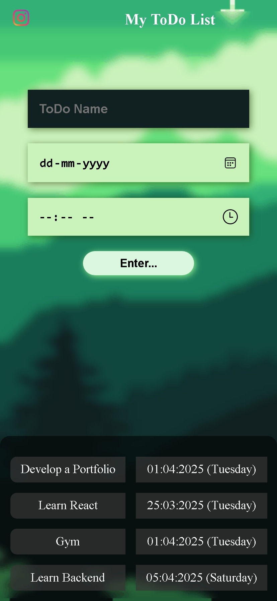

# ToDo List Project

This project is a practice project created as part of the learning path for Full Stack Development. It is not intended for actual use but serves as a dummy project for learning purposes.

## GitHub Page

You can view the project on GitHub Pages [here](https://veeraarun.github.io/My-Task-ToDo/).

## Screenshot

### Laptop View
.jpeg)

### Mobile View

## Project Overview

The ToDo List project is a simple web application that allows users to add, display, and delete tasks. Each task includes a name, date, and time. The project is built using HTML, CSS, and JavaScript.

## Features

- Add new tasks with a name, date, and time.
- Display the list of tasks.
- Delete tasks from the list.

## How I Learned

I learned to build this project through various resources:
- YouTube tutorials
- Articles and documentation from MDN, W3Schools, and other sources
- Using AI tools for resolving doubts and learning new concepts

## File Structure

- `index.html`: The main HTML file that contains the structure of the web application.
- `style.css`: The CSS file that styles the web application.
- `script.js`: The JavaScript file that contains the logic for adding, displaying, and deleting tasks.

## Note

This project is for practice purposes only and is not intended for actual use. It is a simple implementation to help understand the basics of HTML, CSS, and JavaScript.
